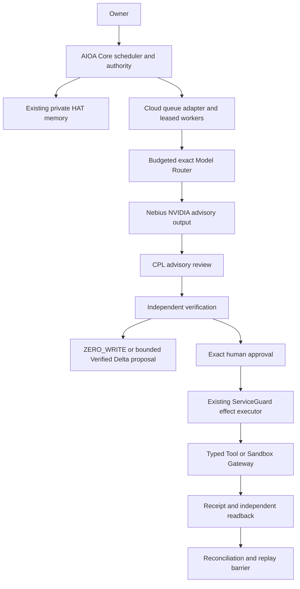

# Nebius Cloud Agent Layer V1 specification

DESIGN ONLY — no layer runtime is implemented by this mission. This extends AIOA Core. Current evidence proves one tiny Lightning live inference and a local fixture approval/effect/restart/replay flow. It does not prove distributed execution, serverless deployment, sustained reasoning or canonical learning from preferences.

## Authority and composition

One existing Core scheduler owns task transitions. A Cloud Job Scheduler is an adapter/queue policy within that scheduler, not a second autonomous scheduler. One native HAT/private memory engine, one approval path, one ServiceGuard executor remain. AgentWorker and verifier workers cannot mint human approval, bypass guards or write canonical memory directly.

MODEL AUTHORITY NONE; MEMORY AUTHORITY NONE; CPL AUTHORITY NONE; HUMAN EFFECT AUTHORITY YES. Verified Delta eligibility is evidence, not effect approval. Unknown outcome must reconcile before retry.

## CloudTask contract (proposed version 1)

Immutable fields: schema_version, task_id (host-generated globally unique), owner_scope_id, created_at_utc, task_digest, authority_scope (typed resource IDs and allowed verbs), initial_budget (decimal currency, maximum input/output tokens, provider ceilings, escalation reserve), deadline_at_utc, privacy_policy_id, recovery_policy_id, idempotency_namespace. Canonical serialization and digest bind all immutable values.

Mutable values use transactional versions, never mutate original identity: state, version, run_id, attempt_id, lease_epoch, target_revision, proposal_digest, approval_reference, cost_reservation_id, receipt_digest, reconciliation_state. Budget/deadline increases require explicit operator policy/human amendment, recorded as a new revision invalidating outstanding approval where the effect binding changes. No self-granted authority scope expansion.

A run_id identifies a resumed scheduling episode; an operation_id identifies the same consequential effect across all runs. Retrying must not mint a fresh effect operation identity to evade replay protection. Owner scope is enforced on every lookup, claim, readback and receipt access. No raw private payload in public events.

## AgentWorker contract

Inputs: scoped task descriptor, minimal memory references approved for transient use, immutable model route, budget reservation, cancellation/deadline token, lease/fence. Outputs: advisory proposal schema, uncertainty, bounded evidence references, requested escalation. Worker may propose typed actions; executor independently validates schema, owner, resource revision, approval digest and fence. Model text never becomes executable command strings. Verifier independence means independent evidence/source and implementation where practical, not merely a second prompt to the same model. No worker grants approval.

## Scheduler adapter

Core dispatches bounded units to a queue transport, handles deadline/cancellation and persisted transitions with version compare-and-swap. Queue redelivery is expected and must be harmless. No recurring deployment is authorized now. Long-running tasks are sequences of bounded cancellable units with explicit terminal and suspended states, not unbounded provider calls. A provider timeout does not imply an effect failure. Cancellation blocks new reservations/effects, but permits read-only reconciliation of already dispatched work.

## Exact Model Router

These are case-sensitive IDs observed in the archived 2026-10-03 catalog, not a claim of future availability:

| Role | Exact archived ID | Policy |
|---|---|---|
| FAST / Lightning | `nvidia/Nemotron-3_5-Lightning` | Default small advisory task, bounded prompt and completion |
| BALANCED / Super | `nvidia/nemotron-3-super-120b-a12b` | Explicit host purpose such as multi-agent CPL, reserved budget |
| ULTRA | `nvidia/Nemotron-3-Ultra-550b-a55b` | Explicit non-model escalation condition plus policy authorization and escalation reserve |

Future routes require fresh validated catalog (existing limit 24h), reviewed exact ID, recent official rate quote, reported-model validation, stop-only decoding and fallback=false. Ambiguous/missing models block. Escalation is a new route reservation, never a silent retry. Model suggestion alone cannot authorize escalation or spend. No additional catalog or inference request is made in this mission.

## Tool/Sandbox Gateway

Gateway sits below ServiceGuard. Capability registry maps fixed typed verbs to bounded handlers, validated resource IDs, parameter schemas, egress allowlists and readback contracts. Sandbox jobs use pinned reviewed images and fixed entrypoint templates; model input is data only, never a shell fragment. No general model-owned shell endpoint. Filesystem, network, CPU/GPU/time ceilings and secrets injection are controlled by host policy. Consequential write approval binds task/owner/operation/target/revision/proposal digest and expires; mismatch returns ZERO_EFFECT. Read-only capabilities also need privacy and resource-scope checks.

## Durable store abstraction

Core sees vendor-neutral transactions: read_task, compare_and_swap_state, claim_lease, reserve_budget, bind_approval, begin_effect_intent, append_receipt, record_readback, reconcile_operation, append_event. Transactions enforce unique(owner_scope, operation_id), task_version and monotonic fence; intent/outbox and event append commit together. Store serializable isolation or explicit equivalent invariants must be proven under contention. CockroachDB is a candidate adapter, not Core authority logic. Vendor selection/deployment/credentials are blocked pending later decisions and authorization.

An external target cannot join the local DB transaction automatically. Exactly-once effect requires target-side atomic idempotency plus durable receipt and independent readback; transactional outbox alone provides at-least-once delivery. Without target guarantees, ambiguous dispatch remains UNKNOWN and no blind retry is allowed. Current fixture proves a local contract only.

## Worker lease and fencing

Lease key=(owner_scope, task_id), holder worker_id, lease_epoch monotonically increasing, expires_at from trusted store clock, version. Atomic claim or renewal checks existing expiry/version; stale holder loses scheduling/effect eligibility. ServiceGuard and target both validate fence at the actual effect boundary; a pre-dispatch lease check alone is insufficient. Approval remains bound to the exact action while fence checks enforce current dispatch ownership. After lease takeover reconcile prior operation before any retry. Heartbeat loss cannot prove failure. No concurrency scaling until race/expiry/partition tests establish one accepted effect per operation and rejection of all stale fences.

## Persistent state and recovery

Proposed states: CREATED → MEMORY_READY → ADVISORY_READY → CPL_REVIEWED → VERIFIED or ZERO_WRITE → APPROVAL_REQUIRED → APPROVED → EFFECT_INTENT_RECORDED → EXECUTING → EXECUTED → READBACK_VERIFIED → RECONCILED. REPLAY_BLOCKED is a repeat request outcome associated with a reconciled operation, not a new effect. Canonical memory ZERO_WRITE is separate from typed-action execution eligibility.

Other states: BUDGET_BLOCKED, MODEL_UNAVAILABLE, VERIFICATION_REJECTED, PRIVACY_BLOCKED, APPROVAL_EXPIRED, CANCELLED, DEADLINE_EXCEEDED, UNKNOWN, RECONCILIATION_REQUIRED, MANUAL_REVIEW_REQUIRED. Store corruption/credential exposure suspends affected dispatch. UNKNOWN is neither FAIL nor PASS. A missing receipt after dispatch, uncertain timeout, crash after target apply or inconsistent readback moves to reconciliation. Negative readback alone cannot prove non-application unless target supplies authoritative operation history and revision semantics.

## Cost Governor

Atomic reserve worst-case prompt plus visible/reasoning output at recent rates before each request. Ledger separates reserved, confirmed billed/usage-based estimate, released and ambiguous liabilities; estimated provider usage is not invoice proof. Per-task/provider/global limits and dedicated escalation reserve must all pass. Concurrent reservations cannot overcommit. Transport uncertainty holds reservation until reconciliation/accounting deadline or manual resolution; no free budget from ambiguous timeout. Global kill switch denies new paid requests and consequential effects; read-only recovery remains available. Shutdown is not automatic rollback of an applied effect.

## Events and observability

Allowlist only: event_id, schema, owner opaque reference, task_id, run_id, operation_id, transition/from/to, store_version, lease_epoch, provider/exact requested/reported model, safe finish_reason/request_id/usage/latency, approval_state (not token), receipt_hash, reconciliation_outcome, safe error category, budget estimate/currency. Append-only sequence is committed with state. Public events contain no HAT text, prompts, completion/reasoning, credentials, headers, raw payloads or approval tokens. Duplicate events can be deduplicated by event identity without hiding duplicate effect attempts. Correlation IDs are scrubbed independently.

## Privacy boundary

HAT owner isolation follows existing native memory. Persist private preference in private storage intentionally; retrieve only minimal scoped transient context for advisory. Public receipts/projections/events persist references/counts and digests only. Canonical learning requires existing independent Verified Delta checks and provenance; memory is not canonical truth or execution authority. Provider egress of any private data requires owner/policy consent and data minimization; no blanket consent is inferred from this spec. Define retention, access control and deletion separately for private store and append-only audit, without embedding private text in immutable evidence.

## Advance/stop conditions

No implementation until explicit freeze release. Before any live worker: authorize budget/egress, obtain credentials privately, revalidate catalog/pricing and pass post-unlock tests. Stop scaling on duplicate apply, stale-fence acceptance, cross-owner access, unbounded cost, authority bypass or unresolved UNKNOWN effect. Serverless remains BLOCKED_BY_CREDENTIALS and NOT_AUTHORIZED; successful tiny inference does not remove these blockers.
