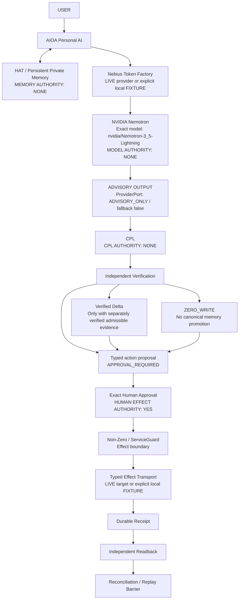

# AIOA spArkHAT × Nebius / NVIDIA — final architecture

This diagram describes the authority path. An arrow carries bounded data or an
explicit request; it does not transfer effect authority to a model, memory, or
CPL. The launcher composes the existing runtime rather than adding a scheduler,
memory engine, or executor.

## Demo interpretation

The default recording uses **Provider: FIXTURE** and **Effect target: FIXTURE**.
It uses the exact Lightning model identifier to exercise the Nebius-compatible
contract; that identifier in a fixture is not evidence that NVIDIA ran a model.
The optional provider mode is **Provider: LIVE**, **Effect target: FIXTURE**.
Only an actual validated Token Factory receipt proves live inference. The
single Prompt 03 smoke in `live_smoke_20261003T130702Z.json` passed with exact
Lightning identity and `stop`; this validates that one provider call, not the
fixture maintenance flow or live Serverless effects. No live Serverless effect
is claimed.

Private HAT retrieval supplies owner-scoped context. Retrieval is not canonical
truth and grants no execution permission. A model review or completed CPL is
also not independent proof. In the maintenance fixture, a stored private
constraint does not establish an admissible canonical fact: the memory delta
must remain `ZERO_WRITE`. A separately verified typed action can still proceed
to exact human approval. This is different from canonical memory promotion.

The current fixture launcher demonstrates the existing CPL's full 1+3+1
sequence with its established synthetic review prompt/evidence. That is a
separate review demonstration, not a CPL review of the maintenance action.
The maintenance advisory and independent typed-action verification retain
their own existing path. The diagram specifies the intended review/authority
relationship; this distinction is part of the demo's verified scope.

The action authority belongs to the human approving the exact proposal. That
approval records consent; it does not itself apply the effect. A separate
Execute / Resume request passes through the existing ServiceGuard boundary.
The target accepts only its typed contract with revision fencing and a stable
operation identity. There is no arbitrary shell endpoint or model executor.

## Outcome semantics

| Observation | Meaning | Permitted next action |
| --- | --- | --- |
| `ADVISORY` | Bounded model output, no effect authority | Verify and prepare a typed proposal |
| `VERIFIED` | An explicitly identified independent verification passed | Continue within that verification's scope |
| `ZERO_WRITE` | No canonical memory delta admitted | Keep private context separate from canonical truth |
| `APPROVAL_REQUIRED` | Exact action awaits a human | Human may approve the displayed proposal |
| `APPROVED` | Exact consent recorded; effect count still zero | Separate Execute / Resume request |
| `EXECUTED` | Dispatch occurred; inspect receipt/readback evidence | Read-only reconciliation if outcome remains unknown |
| `RECONCILED` | Receipt and independent target state agree | Preserve evidence; do not reapply |
| `REPLAY_BLOCKED` | Durable evidence blocks duplicate execution | Report the existing result |

`UNKNOWN` is neither failure nor success. After an ambiguous acknowledgement,
the runtime reconciles from durable receipts and independent readback before
any retry could be considered. The demo replay proof requires exactly one
target apply and zero duplicate effects.

## Deployment boundary

The HTTPS adapter is available for a separately authorized typed target.
Nebius Serverless deployment remains `BLOCKED_BY_CREDENTIALS`; project/region,
endpoint, injected authentication, durable storage and separate deployment
authorization are not supplied by the recording launcher. The final evidence
manifest records the actual provider result and offline verification counts.
