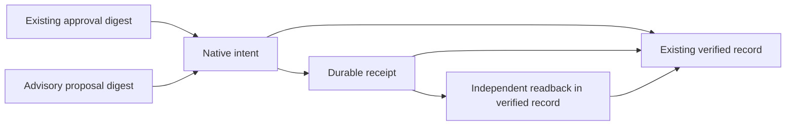

# Local causal receipt graph — block 05

Run the existing deterministic reviewer path from the repository root:

```bash
python3 -I -B scripts/nvidia_reviewer_preflight.py
```

No provider credentials or cloud resources are required. The default path uses the existing fixture provider, human-decision fixture and disposable loopback ServiceGuard target. It performs one fixture effect, independent target readback, runtime restart and replay without another dispatch. It does not authorize any live effect. The generated `AIOA_NVIDIA_COMPETITION_DEMO.json` contains `receipt_graph`; preflight checks graph equality across restart/replay and authority `NONE`.

The graph is a bounded READ projection over existing Core-scoped OPERATION/AUDIT records, not another receipt store, authority engine or executor. `CoreServiceGuard.receipt_graph(READ principal, operation_id)` reads one consistent transaction snapshot with fixed phase keys. It exposes hashed references and timestamps, never raw consent IDs, owner identifiers, proposal text or effect commands. Its local serialized budget is 8192 bytes. MCP's external planner artifact ranges remain 400 bytes / 12 lines; this does not add or broaden an MCP tool.



`valid_time` is copied only from the existing event's `approved_at`, `revoked_at` or `dispatched_at`. It stays null when the producer has no event timestamp. `transaction_time` comes from the native audit's local `recorded_at`, prepared outside the retryable transaction and retained durably with the record. This is a journal timestamp, **not** a database commit timestamp or linearization point. Legacy audit records without this field remain `UNKNOWN_LEGACY`; current observation time is never substituted. Clock skew is retained, not used to invent ordering. Causal edges come from existing digest bindings.

Digest mismatch, missing dependent record/audit, incorrect identity/scope, unsupported phase or malformed time fails projection. Saved measurements use the existing native observation validator; their revision, effect count and maintenance mode must match the saved receipt even if an inconsistent record has been rehashed. Intent without verified evidence stays `UNKNOWN`, with `RECONCILE_READ_ONLY`; the graph has no retry/dispatch capability. `COMPLETE` means the expected native provenance chain is present. `PROVENANCE_ONLY` does not independently reverify target truth or validate a human signature. Existing ServiceGuard authority, independent readback and replay checks retain their own responsibility.

Historical Nebius G1 transport proof remains separate; its incomplete advisory content remains REJECTED. Fixture content is not relabeled LIVE. DVM/pheromone stay SHADOW. Production signer custody, distributed authority, general event corrections/validity intervals and database-commit timestamps remain open. This task changes only local block 05 and the existing reviewer slice.
