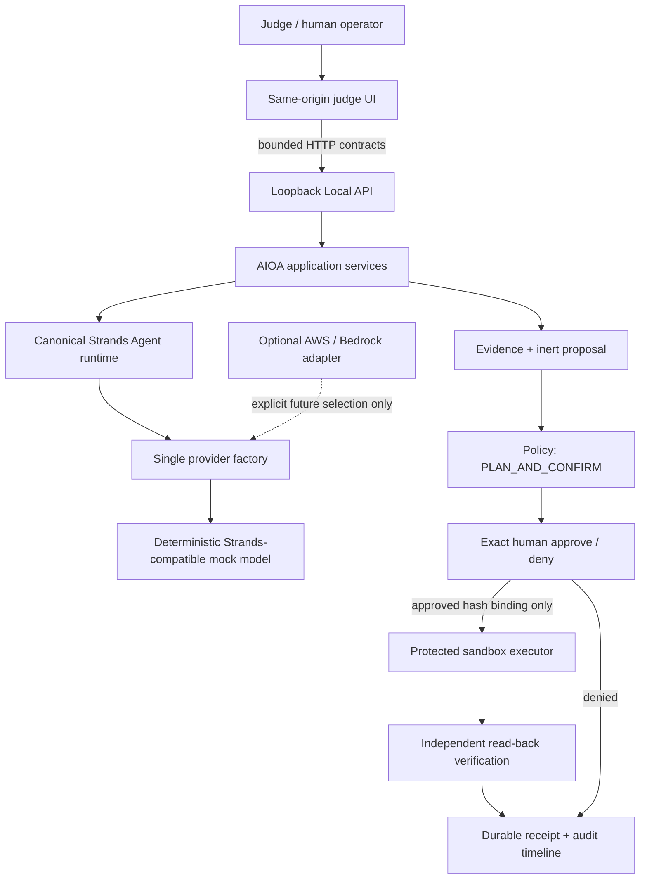

# Portable Judge Experience

## Outcome

B3 turns the existing loopback Local-2 API into the primary judge-facing product flow. It does not
add a second agent, an executor endpoint, a browser-side authority path, or a live-cloud dependency.
The screen presents one coherent sequence:

```text
Observe -> Evidence -> Proposal -> Policy -> Human -> Execute -> Verify -> Receipt
```

The interface labels itself `DEMO SANDBOX`, `portable`, and `mock`. It never describes a synthetic
resource or local mutation as live AWS. The canonical five-tool Strands Agent and provider factory
remain the project runtime architecture; the browser is intentionally limited to the existing
Non-Zero application services rather than receiving direct agent-tool or mutation access.

## Start in one command

From the repository root after installing the declared dependencies:

```bash
.venv/bin/python scripts/run_local_hitl_api.py --open-browser
```

The server binds only to `127.0.0.1`. The launcher transfers the owner-only credential in the URL
fragment, which is not sent in the HTTP request, and the page removes it immediately. The credential
is exchanged once for a `SameSite=Strict`, `HttpOnly` session cookie. The raw token is not written to
browser storage, printed in the page, returned by the API, or included in screenshots. If automatic
browser opening is unavailable, open the printed loopback URL and use the owner-only token file
through **Manual local-session fallback**.

## Three-minute primary flow

1. Confirm the visible `DEMO SANDBOX`, `PORTABLE / MOCK`, and `STRANDS` labels plus zero real-cloud
   writes and zero external network calls.
2. Select **Release an unattached Elastic IP**. One click creates a bounded run from the seeded local
   fixture and stops at `AWAITING_APPROVAL`.
3. Inspect the resource finding, target, operation, impact, authority class, evidence fingerprint,
   evidence hash, and inert proposal hash.
4. Select **Review exact request**, then **Approve**. Approval becomes durable but performs no
   mutation.
5. Select **Execute approved action**. The only allowed sandbox mutation executes once, independent
   read-back is persisted, and the run reaches `SUCCESS_WITH_EVIDENCE`.
6. Select **Test replay protection**. The existing receipt reconciles with no second mutation.

For the denial proof, start **Deny a public-ingress change**, load its exact request, and select
**Deny**. The terminal result is `DENIED_BY_HUMAN`, the run mutation count remains zero, and no
execution or verification receipt exists.

## Authority and API boundary



The diagram shows product ownership, not a browser-to-tool call graph. The interactive Local-1/2
path invokes the deterministic provider and the same application-owned policy, persistence,
approval, executor, and verification contracts. The canonical portable demo separately invokes the
actual `strands.Agent` with all five registered tools and binds that proof into its evidence receipt.
The UI does not expose any tool or provider call directly.

The loopback surface is:

| Method and path | Purpose | Mutation authority |
|---|---|---|
| `GET /health` | process liveness | none |
| `GET /ready` | portable/provider/sandbox readiness truth | none |
| `GET /` | self-contained judge UI | none |
| `GET/POST/DELETE /api/session` | inspect, exchange, or clear browser authentication | none |
| `POST /api/runs` | start one server-budgeted observation and proposal | none |
| `GET /api/runs/{run_id}` | sanitized durable view and audit timeline | none |
| `POST /api/runs/{run_id}/approval-request` | create an exact expiring challenge | none |
| `POST /api/runs/{run_id}/decision` | persist exact human approval or denial | decision only |
| `POST /api/runs/{run_id}/resume` | resume the already bound workflow | one allow-listed sandbox effect at most |

There is deliberately no `/execute`, `/mutate`, arbitrary shell, URL, cloud-client, or browser tool
endpoint. Cookie-authenticated state-changing requests also require the non-simple
`X-AIOA-Intent: judge-console-v1` header. Bearer authentication remains available to existing local
verification clients.

## Evidence projection

`GET /api/runs/{run_id}` returns a judge-safe projection of authoritative state:

- run, trace, and workflow state;
- resource evidence and provenance;
- exact inert proposal and evidence fingerprint;
- approval-request, decision, intent, receipt, and verification hashes;
- before/after resource state;
- per-run and process-local sandbox mutation counts;
- provider and external-network counters; and
- a bounded, ordered, redacted audit timeline.

Raw bearer values, decision nonces, nonce hashes, actor-session identifiers, credentials, exception
text, and environment values are excluded. Audit metadata uses a fixed allowlist. A refreshed page
retains only the non-secret run ID in its fragment and reloads durable truth through the HttpOnly
session.

## Browser and concurrency behavior

- All action buttons enter a shared busy state before awaiting a response, preventing accidental
  double-click dispatch from one tab.
- Backend idempotency remains authoritative: a repeated terminal resume reconciles the receipt
  instead of executing again.
- A second approval request supersedes an older tab's challenge. The stale decision fails closed;
  the UI reloads durable truth and asks the judge to review the current exact request.
- Refresh restores the run ID and state. Restarting the local server with the same paths restores the
  durable checkpoint and receipt.
- The responsive layout has dedicated desktop and sub-700px behavior, horizontal stage scrolling,
  44px minimum controls, focus-visible outlines, reduced-motion support, and polite live status.

Reviewed reference captures:

- [Desktop verified-success state](assets/judge-ux-desktop-success.png)
- [Desktop human-denial state](assets/judge-ux-desktop-denied.png)
- [Mobile verified-success state](assets/judge-ux-mobile-success.png)

## Verification

Focused B3/B4 checks:

```bash
.venv/bin/python -m pytest -q \
  tests/unit/test_judge_console_ui.py \
  tests/unit/test_judge_console_launcher.py \
  tests/unit/test_local_hitl_api.py \
  tests/integration/test_local_hitl_http_server.py \
  tests/integration/test_portable_judge_experience.py
.venv/bin/python scripts/run_b4_hardening_gate.py
.venv/bin/python -m ruff check .
```

The integration suite uses the real loopback server and proves cookie bootstrap, approve, stale-tab
rejection, duplicate resume, restart recovery, denial, sanitized evidence, one approved sandbox
mutation, zero denied mutations, and zero provider/cloud network calls. Chrome reference captures
are generated locally against loopback with external host resolution blocked. They are visual evidence, not a
substitute for the contract suite.

## Intentional limits

- This is not a public endpoint and has no CORS allowance.
- The loopback API has bounded body/header sizes, socket waits, and handler concurrency; it does not
  claim a public multi-user identity or rate-limiting service.
- The deterministic model path requires no paid key and makes no external request.
- The browser does not claim live Strands model inference, AWS identity, IAM effectiveness, Bedrock
  access, production availability, or real infrastructure mutation.
- B4 local reliability/security/evidence hardening is complete; externally anchored signatures and
  public-host controls are not claimed.
- B5 container freezing, artifact manifest, and clean-container reproduction are complete and bound
  to the local-only build-complete attestation. B6 public-package assembly remains pending.
