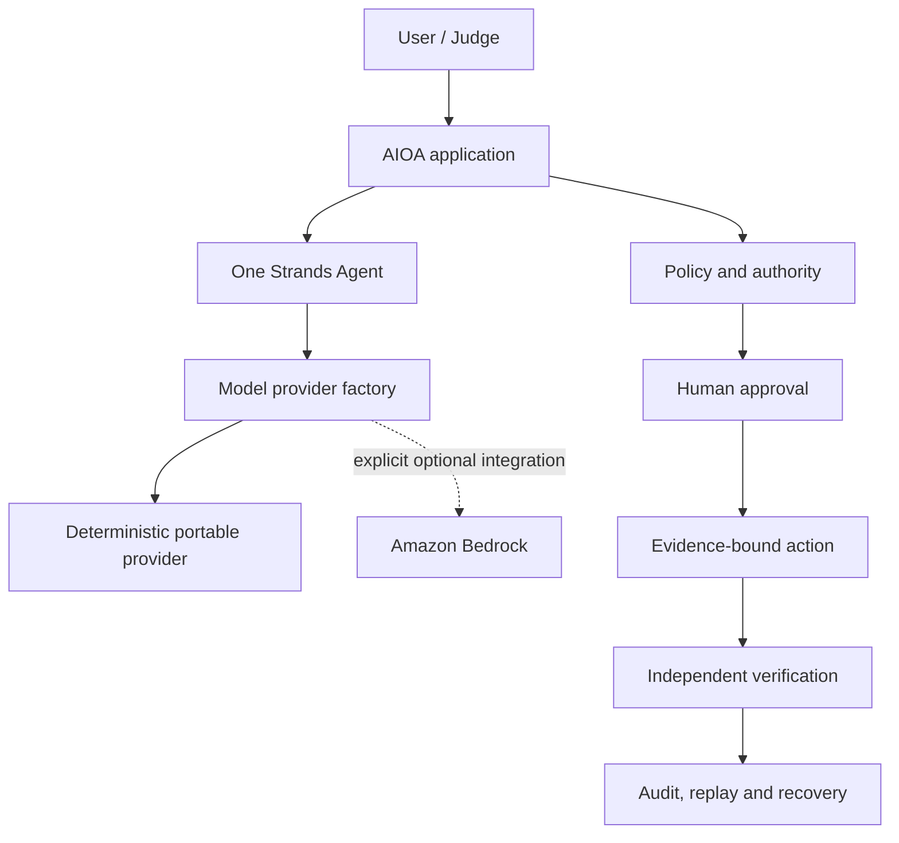

# AIOA Portable Runtime

## Contract

Portable mode is the supported default application runtime:

```text
AIOA_RUNTIME_MODE=portable
AIOA_MODEL_PROVIDER=mock
AIOA_AWS_INTEGRATION_ENABLED=false
```

It imports and starts without AWS credentials, credential discovery, a model API key, a local LLM,
or a network service. It creates the real canonical `strands.Agent` and the frozen five-tool surface.
The deterministic model is a native Strands `Model`; model output remains untrusted and receives no
execution authority.



AWS, Bedrock, DynamoDB, Lambda, CloudWatch, S3, and AgentCore are optional integration or deployment
targets. None is required for import, startup, tests, Strands execution, HITL, evidence, replay,
recovery, the local API, or the judge demo. Historical AWS deployment contracts remain preserved but
do not grant deployment or mutation authority.

## Portable container contract

The canonical deployable process is `python -m aioa_cloudops_agent.portable_server`. It composes the
existing Local-2 API, the same provider-neutral Strands Agent, durable truth, mock inventory, human
approval, execution, verification, recovery and replay controls. It is not a deployment-only agent
loop. The image is locked to CPython 3.12 on `linux/amd64`; the base image, build backend and complete
runtime dependency closure are digest/hash pinned.

| Class | Environment variable | Default / required value | Behavior |
| --- | --- | --- | --- |
| REQUIRED image identity | `APPLICATION_VERSION` | build argument; `0.2.0rc1` for this candidate | Public non-secret version label. |
| REQUIRED image identity | `SOURCE_COMMIT` | full candidate SHA; `unknown` only for an uncommitted development build | Public non-secret source binding. |
| LOCAL_DEFAULT | `AIOA_RUNTIME_MODE` | `portable` | Any container selection other than `portable` fails before serving. |
| LOCAL_DEFAULT | `AIOA_MODEL_PROVIDER` | `mock` | Ambient AWS variables never select Bedrock. |
| OPTIONAL portable | `AIOA_MODEL_ID` | `aioa.mock.deterministic-v1` | If supplied, it must equal the deterministic model ID. |
| LOCAL_DEFAULT | `AIOA_HOST` | image: `0.0.0.0`; source run: `127.0.0.1` | Only these two bind addresses are accepted. Publish the container port on host loopback. |
| LOCAL_DEFAULT | `AIOA_PORT` | `8765` | Integer `1..65535`; both endpoints use this port. |
| REQUIRED safety | `AIOA_ALLOWED_ORIGINS` | `same-origin` | No wildcard CORS or reflected origin is supported. |
| REQUIRED safety | `AIOA_ALLOWED_EGRESS` | `none` | Portable startup accepts no other egress policy. Use an internal/no-network runtime network. |
| REQUIRED storage | `AIOA_STORAGE_MODE` | `file` | No hidden database or cloud store is selected. |
| LOCAL_DEFAULT storage | `AIOA_LOCAL_HITL_STATE_PATH` | image: `/var/lib/aioa/durable-truth.json` | Versioned, integrity-protected durable truth. |
| LOCAL_DEFAULT storage | `AIOA_LOCAL_INVENTORY_PATH` | image: `/var/lib/aioa/mock-inventory.json` | Separate mock resource state. |
| LOCAL_DEFAULT secret name | `AIOA_LOCAL_API_TOKEN_PATH` | image: `/var/lib/aioa/operator.token` | Owner-only bearer material is generated at runtime; the value is never an image input or log field. |
| LOCAL_DEFAULT | `AIOA_SESSION_TTL_SECONDS` | `600` | Human approval/session challenge lifetime, bounded to `60..3600`. |
| REQUIRED fixed limit | `AIOA_REQUEST_TIMEOUT_SECONDS` | `10` | Socket timeout; any other value is rejected because the server limit is application-owned. |
| REQUIRED fixed limit | `AIOA_REQUEST_SIZE_LIMIT_BYTES` | `16384` | HTTP body ceiling; any other value is rejected. |
| LOCAL_DEFAULT | `AIOA_PROVIDER_TIMEOUT_SECONDS` | `0` | Deterministic mock makes no provider network call. |
| LOCAL_DEFAULT | `AIOA_RETRY_BUDGET` | `0` | No provider transport retry exists in portable mode. |
| OPTIONAL | `AIOA_LOG_LEVEL` | `INFO` | One of `INFO`, `WARNING`, `ERROR`; credentials and request headers are never logged. |
| REQUIRED truth label | `AIOA_PUBLIC_MODE_LABEL` | `DEMO_SANDBOX` | Prevents a local demo from presenting as live cloud execution. |
| REQUIRED truth label | `AIOA_SANDBOX_MODE` | `MOCK_OFFLINE` | Exact portable sandbox selection. |
| REQUIRED authority | `AIOA_AUTHORITY_MODE` | `HUMAN_APPROVAL_REQUIRED` | Model output cannot authorize execution. |
| LIVE_ONLY | `AIOA_AWS_INTEGRATION_ENABLED`, `BEDROCK_MODEL_ID`, `BEDROCK_REGION` | absent/disabled here | Optional AWS adapter inputs; forbidden by the portable server. |

`GET /health` is zero-dependency liveness. `GET /ready` checks the explicit portable/mock provider
and both protected local stores; neither endpoint needs credentials. The writable path is
`/var/lib/aioa`; the application root can remain read-only. PID 1 is the Python application and
handles `SIGTERM`/`SIGINT` through the server cleanup boundary.

### Build and isolated smoke

```bash
SOURCE_COMMIT="$(git rev-parse HEAD)"
docker build --platform linux/amd64 \
  --build-arg APPLICATION_VERSION=0.2.0rc1 \
  --build-arg SOURCE_COMMIT="$SOURCE_COMMIT" \
  --tag aioa-portable:0.2.0rc1 .
docker volume create aioa-portable-state
docker run --detach --name aioa-portable \
  --network none --read-only --tmpfs /tmp:rw,nosuid,nodev,noexec \
  --cap-drop ALL --security-opt no-new-privileges \
  --mount type=volume,src=aioa-portable-state,dst=/var/lib/aioa \
  aioa-portable:0.2.0rc1
docker exec aioa-portable python -c \
  "import urllib.request; print(urllib.request.urlopen('http://127.0.0.1:8765/health').read().decode())"
docker exec aioa-portable python -c \
  "import urllib.request; print(urllib.request.urlopen('http://127.0.0.1:8765/ready').read().decode())"
docker stop aioa-portable
docker rm aioa-portable
docker volume rm aioa-portable-state
```

The image is local only. These commands do not push, deploy, contact AWS, or expose the service on a
host interface. The B5 two-invocation clean-room gate is documented in
[`operations/container-judge-certification.md`](operations/container-judge-certification.md).

## Provider selection

| Mode | Provider | Result |
| --- | --- | --- |
| `portable` | `mock` | supported default; zero provider network calls |
| `portable` | `bedrock` | rejected; no fallback |
| `aws` | `mock` | rejected; no ambiguous substitution |
| `aws` | `bedrock` | optional integration; explicit opt-in and settings required |

The single factory is `providers/factory.py::create_model_provider`. Bedrock imports and client
construction are lazy and reachable only after explicit AWS selection. Missing AWS configuration or
provider availability returns a fixed, typed failure. It never silently falls back to mock.

No paid non-AWS provider is shipped in B0-B2. The existing Strands `Model` boundary can accept one in
a later phase without changing the agent or Non-Zero controls. Deterministic completion and judging
therefore have no secret, paid API, large local model, or hidden network requirement.

## Run locally

After installing the pinned project dependencies:

```bash
cp .env.example .env.local
AIOA_RUNTIME_MODE=portable \
AIOA_MODEL_PROVIDER=mock \
AIOA_AWS_INTEGRATION_ENABLED=false \
.venv/bin/python scripts/run_portable_demo.py
```

The command prints one validated JSON bundle and writes an owner-only copy to
`.local/portable/portable-demo-receipt.json`. It uses a disposable workspace by default. To retain
the sandbox state for inspection, pass a new or empty directory:

```bash
.venv/bin/python scripts/run_portable_demo.py \
  --workspace .local/portable/workspace-001 \
  --output .local/portable/receipt-001.json
```

The command refuses AWS mode even when AWS is otherwise explicitly configured. It never deploys or
calls a live cloud API.

The same implementation is installed as a package module and is the command used by the container
gate:

```bash
.venv/bin/python -m aioa_cloudops_agent.portable \
  --workspace .local/portable/workspace-002 \
  --output .local/portable/receipt-002.json
```

Its reviewed offline contract and synthetic fixture ship as package data, so an installed wheel does
not depend on the source repository's test tree.

## Verification

```bash
.venv/bin/python -m pytest -q tests/integration/test_portable_judge_sandbox.py
.venv/bin/python -m pytest -q tests/unit/test_portable_runtime_boundary.py
.venv/bin/python -m pytest -q tests/unit/test_model_provider_factory.py
.venv/bin/ruff check .
.venv/bin/python -m pip check
```

## Troubleshooting

- `PORTABLE_RUNTIME_CONFIGURATION_INVALID`: remove conflicting runtime variables or set the three
  portable values shown above. No provider fallback occurs.
- `PORTABLE_DEMO_REQUIRES_PORTABLE_MOCK_RUNTIME`: the judge command was given an AWS runtime; use the
  portable settings. The workspace is untouched.
- `VERIFIER_WORKSPACE_NOT_EMPTY`: choose a new or empty retained workspace. Existing evidence is not
  deleted or overwritten.
- `PORTABLE_STRANDS_RUNTIME_UNAVAILABLE`: install the pinned project dependencies. Do not replace the
  Strands runtime with a custom loop.
- `PORTABLE_OUTPUT_SYMLINK_FORBIDDEN`: choose a regular evidence path; the writer will not follow an
  output symlink.
- `PORTABLE_OUTPUT_EXISTING_FILE_UNSAFE`: the selected existing output is not an owner-only, valid
  portable receipt. Choose the canonical `.local/portable/` output or a new path; unrelated files
  are deliberately preserved.
- `local durable state is corrupt or unreadable`: B4 accepts only the versioned integrity envelope.
  Preserve an older unsealed file for forensics and choose fresh local truth/inventory paths; no
  implicit migration or destructive deletion occurs.

The loopback API keeps liveness and readiness separate. `/health` reports process response only.
`/ready` validates portable/mock provider truth plus readable durable and sandbox snapshots and
returns a redacted retryable `503` when either protected file is corrupt.
