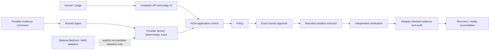

# Reliability, Security, and Evidence Contract

## Scope

This is the B4 contract for the portable deterministic product. It hardens the existing Local-2
workflow; it does not add a second agent, provider abstraction, approval path, or executor. The
canonical judge demo still uses the real Strands Agent. The interactive console still uses the
existing Local-1/Local-2 services and never claims live model inference.



The model and UI have no mutation authority. Only the bounded executor can change the synthetic
inventory, and only after policy plus exact durable human authorization.

## Non-Zero guarantees

- Illegal workflow transitions fail closed. Terminal denial, failure, and verified-success states
  cannot re-enter execution.
- A proposal remains inert (`authorizes_execution=false`). Approval binds run, request, proposal,
  proposal version, action, resource type and ID, evidence, expiry, actor session, and nonce.
- The execution intent independently rebinds run, proposal, evidence, decision, operation, target,
  and the canonical `local-exec:<proposal_hash>` idempotency key.
- Concurrent identical resume requests serialize through process and file locks. The durable sandbox
  receipt makes subsequent attempts reconciliation, not another mutation.
- Provider failures, malformed output, invalid input, corrupt state, and unavailable persistence
  produce explicit failures. None can become approval or success.
- `SUCCESS_WITH_EVIDENCE` remains reachable only after independent read-back verification is stored.

## Durable state and partial-write safety

Durable truth and sandbox inventory are separate files with separate locks and payload types. Each
is a strict, versioned JSON envelope with a canonical SHA-256 over payload type, integrity version,
and exact payload. Reads reject duplicate JSON keys, non-finite values, malformed UTF-8, unknown
envelope fields, wrong payload type/version, and digest mismatch.

Critical writes use a mode-`0600` temporary file in the destination directory, flush and `fsync` the
file, atomically replace the target, then `fsync` the directory. Reads use `O_NOFOLLOW` when the host
supports it. State, inventory, locks, API token, demo receipts, and B4 receipts reject unsafe
symlinks; configured state paths also reject traversal and hard-link aliases between truth and
inventory. Existing unrelated files are not silently replaced.

Limits are deliberately finite:

| Boundary | Limit |
| --- | ---: |
| Durable state or inventory file | 8 MiB |
| Durable runs per local repository | 2,048 |
| Audit events per run | 1,024 |
| Records in one restored collection | 65,536 |
| Judge API request body | 16,384 bytes |
| Request headers | 64 |
| One header value | 4,096 characters |
| Concurrent HTTP handlers | 16 |
| Accepted socket wait | 10 seconds |
| Approval challenge lifetime | 60–3,600 seconds |

The local format intentionally changed at B4. Pre-B4 unsealed state is rejected rather than guessed
or silently migrated. Preserve any old file if it has forensic value, then start the deterministic
demo with fresh state/inventory paths.

## Crash and recovery semantics

The suite injects failures around the canonical durable boundaries, including proposal/checkpoint
creation, approval persistence, approval state transition, execution registration, mutation,
receipt checkpointing, verification, and final success persistence. The strongest B4 case interrupts
immediately after the sandbox mutation but before the receipt reaches durable truth. A restarted
runtime reloads the execution intent, reconciles the receipt from the separately persisted inventory,
verifies it, and reaches success with zero additional mutation.

An incomplete operation is never reported as successful. A known pre-mutation interruption can be
retried from its safe state. A post-mutation durability ambiguity remains `EXECUTING` with an explicit
`LOCAL_RECEIPT_DURABILITY_FAILED` recovery requirement until receipt reconciliation succeeds.

## Evidence integrity and judge timeline

The judge run projection is evidence schema version `2`. One shared lock produces the run,
checkpoint, bounded audit timeline, total event count, and snapshot digest from the same verified
snapshot. The UI displays the snapshot digest and categorizes every event as one of:

- `FACT`
- `AGENT_INFERENCE`
- `POLICY_DECISION`
- `HUMAN_DECISION`
- `ACTION`
- `VERIFICATION`
- `RECOVERY`

The complete local file digest detects accidental corruption and any content edit, deletion,
insertion, or reordering that does not also replace the integrity envelope. Typed reconstruction
then rejects invalid identities, references, fields, and transitions.

This is not an externally anchored signature or an append-only global event chain. A hostile local
user with write access to the state and enough code knowledge could recompute an adjacent SHA-256.
The UI's `VERIFIED` label means the local envelope and typed snapshot validate; it does not claim
hardware-backed provenance or protection against a fully privileged host attacker. A signed or
externally anchored ledger remains outside B4.

## Sensitive-data handling

Durable audit metadata and judge read models reject common provider-neutral credentials, including
AWS access-key IDs, bearer/authorization values, OpenAI-style keys, GitHub tokens, credential URLs,
private-key headers, password/token/secret assignments, and common credential-file paths. The
redaction helper replaces recognized material with `[REDACTED]` without retaining the match.

HTTP errors expose fixed reason codes only. Default HTTP request logging is disabled, browser
credentials are exchanged from a URL fragment into an HttpOnly `SameSite=Strict` cookie, and the
launcher does not print the token or its full filesystem path. Evidence excludes environment dumps,
authorization headers, nonces, actor-session identities, tracebacks, and raw provider payloads.

## Input, configuration, and filesystem rules

- Pydantic models forbid unknown fields and validate bounded enums, UUIDv7 identities, resource IDs,
  exact decisions, and `confirm_execution=true`.
- JSON duplicate keys, queries on mutation routes, unsupported media types, wrong methods, excessive
  bodies/headers, transfer encoding, and malformed paths fail closed.
- Runtime/provider selection is typed. Portable judge mode requires `portable` plus `mock`; AWS and
  network permissions must both be false. There is no silent provider substitution.
- Invalid modes, providers, TTLs, numeric bounds, unsafe paths, same-file truth/inventory aliases,
  corrupt files, and missing optional provider configuration return explicit failures.
- The product exposes no arbitrary shell, URL-fetch, unsafe object deserialization, `eval`, or
  user-controlled output-file overwrite boundary.

## Network and readiness contract

Deterministic judge mode has no required external network path:

| Network class | Portable deterministic behavior |
| --- | --- |
| Required | None |
| Optional provider | Disabled; only an explicitly selected future provider may enable it |
| AWS optional | Disabled and outside the critical path |
| Update/documentation | Not called by application startup or demo |
| Unexpected | Test/gate failure |

The server binds only to `127.0.0.1` and emits no CORS allowance. CSP permits same-origin API access
only. Request size, socket wait, handler concurrency, session authentication, and exact intent-header
checks form the local abuse guard. A public multi-user rate limiter and public identity provider are
not claimed; public hosting remains unauthorized.

`GET /health` proves only that the process can answer. `GET /ready` separately reports process,
provider, and sandbox status, and reads both integrity-protected stores. Corrupt or unreadable state
changes readiness to a redacted retryable `503`; health can remain `200`.

## Provider failure matrix

The deterministic provider can inject timeout, connection failure, rate limit, provider exception,
unavailable model, configuration error, malformed/truncated/empty output, invalid structured output,
policy-invalid proposals, retryable error, and non-retryable error. Each becomes a typed terminal or
bounded retry result before proposal authority. No provider response can bypass policy, approval,
execution, or verification.

## Reproduce the hardening gate

```bash
.venv/bin/python scripts/run_b4_hardening_gate.py
```

The command runs the required approve, deny, interruption recovery, replay, approval tamper,
evidence tamper, provider failure, invalid input, corrupted state, redaction, and zero-egress proofs.
It prints a SHA-256-bound receipt and atomically stores an owner-only copy at
`.local/b4/hardening-gate.json`. The output declares zero AWS calls/mutations, external network
calls, deployments, and pushes. Every proof process loads a fail-closed socket guard that permits
only loopback or Unix-domain sockets; any external `connect`, `connect_ex`, `create_connection`, or
`sendto` attempt fails the gate.

For the complete project gate, also run full pytest, P0, P1, Ruff, package/dependency checks, the
repository secret scan, the reviewer-evidence validator, the portable demo, and the actual loopback
interface as listed in the B4 audit report.

## Remaining limits

- The application is a loopback, single-operator judge product, not a public multi-tenant service.
- Local SHA-256 integrity is not a keyed signature or externally anchored audit ledger.
- A static type checker and repository-wide formatter are not configured; B4 does not add them.
- Container non-root enforcement, container digest, clean-container proof, and the portable runtime
  freeze belong to B5.
- AWS, Bedrock, AgentCore, live cloud mutation, external deployment, publication, and remote push
  remain optional and were not performed.
