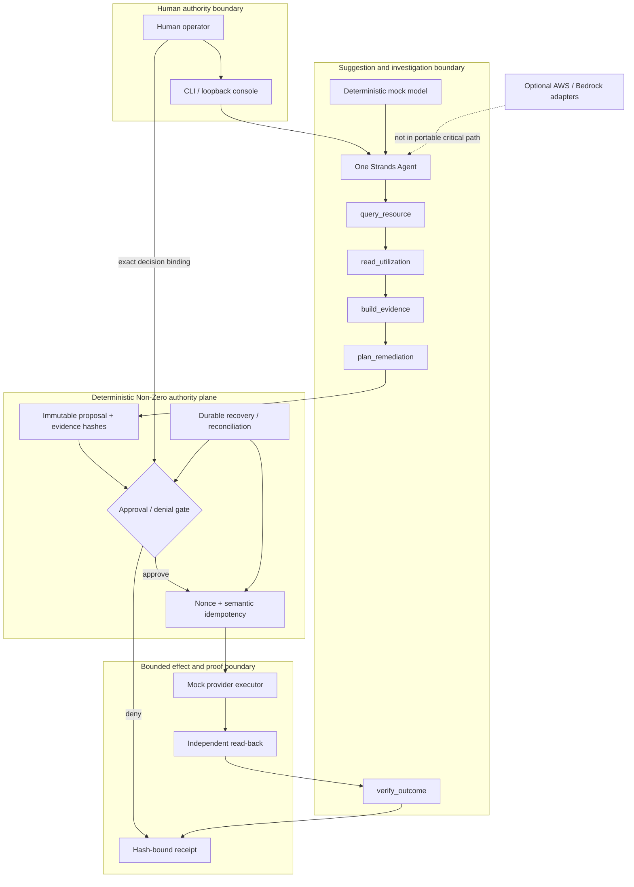
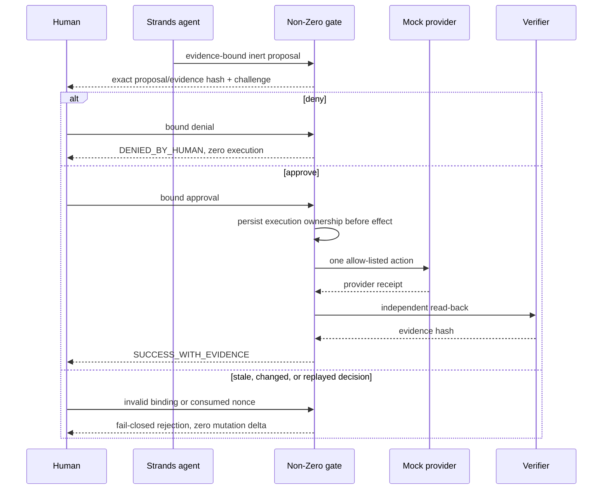

# Judge-safe architecture

## Outcome

AIOA separates model-assisted investigation from consequential authority. The portable path uses one
Strands agent and five bounded tools, but deterministic code owns policy, approval binding,
idempotency, recovery, execution, and independent verification. The default path is offline and
provider-neutral; AWS is optional and is not needed to judge the product.

## Components and trust boundaries

The human boundary supplies authority, not merely input. The agent boundary may select and sequence
known capabilities but cannot create a capability or approve a proposal. The effect boundary accepts
only a validated, unexpired, one-time decision. Provider acknowledgement is not treated as success;
independent evidence must close the run.

## Scenario sequence

Restart recovery resumes from durable truth. If an effect may have occurred, reconciliation reads
provider state and the persisted execution receipt before any retry. An identical replay reconciles;
a conflicting replay is rejected.

## Runtime boundary

The canonical container:

- uses a digest-pinned Python 3.12 base and hash-pinned dependency closure;
- runs as declared UID/GID 65532 with no effective capabilities;
- supports read-only root filesystem plus explicit temporary/state mounts;
- starts `python -m aioa_cloudops_agent.portable_server` as PID 1;
- defaults to mock provider, AWS disabled, and declared egress `none`; and
- exposes health and readiness inside the isolated container.

The deterministic CLI proof runs approve, deny, recovery, reconciliation, replay, binding-tamper,
and five fail-closed probes without AWS credentials or external network connections.

## Evidence boundary

Every public claim is linked to a command, test, or committed receipt in
[`DEVPOST_CLAIMS_MATRIX.md`](DEVPOST_CLAIMS_MATRIX.md). B5 evidence is a local-artifact attestation,
not a registry or deployment receipt. The publication manifest inventories every tracked source
file and records why each file is included, transformed, or excluded.

## Explicit non-claims

This architecture has not been proven as a public multi-user service. It does not claim live AWS,
live Bedrock, effective deployed IAM, production availability, a real cloud mutation, an uploaded
container, or a submitted Devpost entry.
