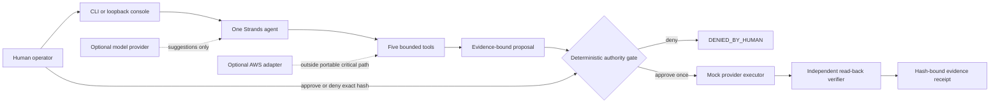

# AIOA Non-Zero CloudOps — Portable Agents for Humans

AIOA is a human-authorized CloudOps agent for operators who need automation without surrendering
control of consequential actions. This is a **local, publication-candidate source bundle** for the
AWS Agents for Humans Hackathon 2026. It has not been deployed, uploaded, or submitted.

## The problem

An agent can sound confident while working from stale evidence, acting without the intended human
authority, retrying a side effect, or reporting success before the result has been independently
observed. Those are unsafe ambiguities for cloud operations.

AIOA applies the Non-Zero rule: no silent, ambiguous, untraceable, unverifiable, or
falsely-successful state may pass as a valid result.

## What AIOA does

One **Strands Agents SDK** agent investigates a bounded resource, gathers evidence, produces an inert
proposal, and stops. Deterministic application code—not model output—then binds an approve or deny
decision to that exact proposal and evidence. An approved action executes at most once and reaches
`SUCCESS_WITH_EVIDENCE` only after independent read-back. Denial, stale bindings, replay conflicts,
and verification mismatch fail closed.

The default demo is deterministic, provider-neutral, credential-free, and offline. It uses
AWS-shaped mock resources so judges can inspect approve, deny, restart recovery, reconciliation, and
replay protection without an AWS account, paid model, or network service. Amazon Bedrock and the
bounded AWS adapter remain optional integrations outside the critical path.

## Architecture



The model may suggest; it cannot grant authority. Durable state, nonce consumption, semantic
idempotency, recovery, and verification surround the mutation boundary. See
[`docs/submission/ARCHITECTURE.md`](docs/submission/ARCHITECTURE.md) for the trust boundaries and
scenario sequence.

## Quick start: exact portable container path

Prerequisite: Docker or Podman with Linux-container support. Network access is needed only to obtain
the digest-pinned base image and hash-pinned Python packages when they are not already cached. No AWS
credential or model API key is used.

Verify the extracted candidate, read its exact source reference, and build the canonical Dockerfile:

```bash
sha256sum -c SHA256SUMS
SOURCE_REF="$(python3 -c 'import json; print(json.load(open("PUBLICATION_MANIFEST.json", encoding="utf-8"))["source_ref"])')"
docker build \
  --build-arg SOURCE_COMMIT="$SOURCE_REF" \
  --tag localhost/aioa-portable:b6-public \
  .
```

Run the deterministic judge proof inside an isolated, read-only container:

```bash
docker run --rm \
  --network none \
  --read-only \
  --tmpfs /tmp:rw,nosuid,nodev,noexec,size=64m \
  --cap-drop ALL \
  --security-opt no-new-privileges \
  --entrypoint python \
  localhost/aioa-portable:b6-public \
  -m aioa_cloudops_agent.portable --output /tmp/portable-receipt.json
```

Expected top-level result: `status=PASS`, `runtime_mode=portable`, `provider=mock`,
`external_network_connections=0`, `aws_calls=0`, and `aws_mutations=0`. The receipt also proves:

- approve: one mock mutation only after the explicit decision, then independent verification;
- deny: terminal `DENIED_BY_HUMAN` with no execution receipt and zero mutation;
- recovery: pending approval survives restart and reconciles without a second mutation; and
- replay/binding attacks: rejected with zero mutation delta.

The frozen B5 local artifact is referenced—not republished—by
[`B5_BUILD_COMPLETE_REFERENCE.json`](B5_BUILD_COMPLETE_REFERENCE.json). Its local-only identity is
`localhost/aioa-portable:b5-c2`, image ID
`524fe1212fc65e3d35a015717d03250e25c5ad32359e1c9595878c5bc6b057e8`, and local manifest digest
`sha256:a835f9bdbc7a3854304e5574440a6a9944ea4bd04e839eae317a8e6554855eae`. That tag was never pushed;
the public-candidate rebuild receives its own local identity and is not claimed byte-identical to
the frozen B5 image because this judge-facing README is an export overlay.

## Health and readiness

The canonical server is `python -m aioa_cloudops_agent.portable_server`, configured as PID 1 and a
non-root user in the image. Start it without host networking and probe from inside the container:

```bash
docker run --detach --name aioa-public-check \
  --network none --read-only \
  --tmpfs /tmp:rw,nosuid,nodev,noexec,size=64m \
  --tmpfs /var/lib/aioa:rw,nosuid,nodev,noexec,size=64m,mode=0770,uid=65532,gid=65532 \
  --cap-drop ALL --security-opt no-new-privileges \
  localhost/aioa-portable:b6-public
docker exec aioa-public-check python -c \
  'import urllib.request; print(urllib.request.urlopen("http://127.0.0.1:8765/health", timeout=2).read().decode())'
docker exec aioa-public-check python -c \
  'import urllib.request; print(urllib.request.urlopen("http://127.0.0.1:8765/ready", timeout=2).read().decode())'
docker rm --force aioa-public-check
```

Both probes return HTTP 200 and public-safe JSON. Full cold-start and clean-room instructions are in
[`docs/submission/REPRODUCIBILITY.md`](docs/submission/REPRODUCIBILITY.md).

## Environment contract

The image has safe portable defaults. Override names only when needed; use placeholders, never real
values in source or command history.

| Variable | Safe example | Meaning |
| --- | --- | --- |
| `AIOA_RUNTIME_MODE` | `portable` | Selects the portable runtime |
| `AIOA_MODEL_PROVIDER` | `mock` | Deterministic provider; no paid key |
| `AIOA_AWS_INTEGRATION_ENABLED` | `false` | Keeps AWS outside the path |
| `AIOA_ALLOWED_EGRESS` | `none` | Declares the no-egress contract |
| `AIOA_STORAGE_MODE` | `file` | Uses the private writable state path |
| `AIOA_LOCAL_MODE` | `mock` | Prohibits live fallback |
| `AIOA_PORT` | `8765` | Internal HTTP port |
| `AIOA_LOG_LEVEL` | `INFO` | Public-safe log level |

The complete contract, path permissions, and fail-closed validation rules are documented in
[`docs/PORTABLE_RUNTIME.md`](docs/PORTABLE_RUNTIME.md). Secret variable names are documented there;
no secret value is part of this candidate.

## Evidence and claims

The portable command prints a schema-validated JSON receipt and writes it with owner-only
permissions when a writable output path is supplied. Inspect `status`, the approve/deny objects,
recovery and replay fields, all network/AWS counters, and `receipt_sha256`.

- B5 build-complete evidence: [`docs/evidence/release/`](docs/evidence/release/)
- claim-to-proof map: [`docs/submission/DEVPOST_CLAIMS_MATRIX.md`](docs/submission/DEVPOST_CLAIMS_MATRIX.md)
- demo narration: [`docs/submission/DEMO_SCRIPT_DRAFT.md`](docs/submission/DEMO_SCRIPT_DRAFT.md)
- publication inventory: [`PUBLICATION_MANIFEST.json`](PUBLICATION_MANIFEST.json)
- excluded material and rationale: [`PUBLICATION_EXCLUSIONS.md`](PUBLICATION_EXCLUSIONS.md)

## Known limitations

- Certification is local, offline/mock, and Linux/amd64; it is not production deployment evidence.
- No live AWS resource, Bedrock model, public endpoint, registry image, or external service was used.
- No real cloud mutation has been performed by this project.
- The optional AWS deployment design requires separate operator authorization and live evidence.
- Rootless engines with only a single subordinate UID/GID mapping may need host configuration before
  they can run the declared container UID 65532; do not work around that in a real deployment by
  weakening the image.
- The browser console is loopback-only and is not a hosted multi-user service.

## License and hackathon disclosure

The canonical repository has carried the MIT License since its initial clean-room commit; the exact
[`LICENSE`](LICENSE) is preserved. Concepts from earlier AIOA/AOIA and Non-Zero research are disclosed,
but this repository states that no prior implementation code was imported. See
[`docs/submission/PRIOR_ART_DISCLOSURE.md`](docs/submission/PRIOR_ART_DISCLOSURE.md) and
[`PRIOR-ART.md`](PRIOR-ART.md).

This bundle is preparation only. Archive upload, repository publication, deployment, video
publication, and final Devpost submission remain human-controlled actions.
